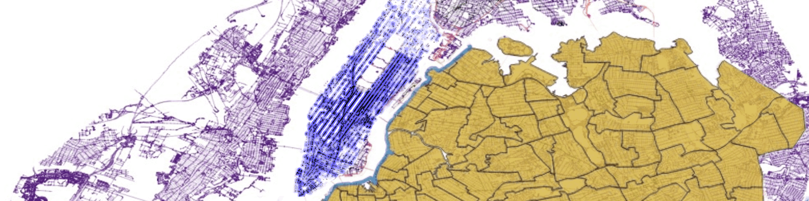

<picture>
  <source media="(prefers-color-scheme: dark)" srcset="figures/banner_dark.png">
  <source media="(prefers-color-scheme: light)" srcset="figures/banner_light.png">
  
</picture>


# Large-scale Ridesharing DARP Instances Based on Real Travel Demand

[](https://arxiv.org/abs/2305.18859)
[](https://doi.org/10.5281/zenodo.7986103)


This repository presents a set of large-scale ridesharing Dial-a-Ride Problem (DARP) instances. The instances were created as a standardized set of ridesharing DARP problems for the purpose of benchmarking and comparing different solution methods.  

The instances are based on real demand and realistic travel time data from 3 different US cities, Chicago, New York City and Washington, DC. The instances consist of real travel requests from the selected period, positions of vehicles with their capacities and realistic shortest travel times between all pairs of locations in each city.

The instances and results of two solution methods, the Insertion Heuristic and the optimal Vehicle-group Assignment method, can be found in the linked dataset.

The dataset and methodology used to create it are described in the paper [Large-scale Ridesharing DARP Instances Based on Real Travel Demand](https://arxiv.org/abs/2305.18859). This paper was accepted to the [Intelligent Transportation Systems Conference 2023](https://2023.ieee-itsc.org/) ([see the PowerPoint presentation](./presentation-final.pptx)).


## Table of contents
- [Instances and Results download](#instances-and-results-download)
- [Time Format](#time-format)
- [Instances](#instances)
  - [Instance configuration file](#instance-configuration-file)
  - [Requests Files](#requests-files)
  - [Vehicles Files](#vehicles-files)
  - [Distance Matrix - the travel time model](#distance-matrix-the-travel-time-model)
  - [Instance Interpretation and Usage](#instance-interpretation-and-usage)
  - [Instance metadata and supporting files](#instance-metadata-and-supporting-files)
  - [Instance generation config files](#instance-generation-config-files)
  - [Visualization files](#visualization-files)
- [Results](#results)
  - [Solution file](#solution-file)
  - [Solution meta-data](#solution-meta-data)
- [Instance Creation](#instance-creation)
  - [Sizing](#sizing)
  - [Public Datasets used in the creation of the instances](#public-datasets-used-in-the-creation-of-the-instances)
- [Solution Checker](#solution-checker)
  - [Command line usage](#command-line-usage)
- [Citation](#citation)
- [License](#license)


## Instances and Results download

[](https://doi.org/10.5281/zenodo.7986103)

The dataset of instances and associated results are available through the dataset repository Zenodo. The dataset is compressed by [7zip](https://7-zip.org/) to adhere to the Zenodo dataset size limits, with some of the archives split into multiple parts. The distance matrices, instances, and results are in separate archives. However, the folder structure inside the archives follows the schema described below. Thus, unpacking the distance matrix archives places them in an appropriate directory in the `Instances` folder.  The dataset is licensed under the [Creative Commons Attribution 4.0 International](https://creativecommons.org/licenses/by/4.0/) license.


## Terminology
When solving the DARP problem, for each request, we need to determine two times:

- pickup time, and
- drop-off time.

In line with the DARP literature, these times represent the start of the service, i.e., the start of the on-boarding process, and the start of the off-boarding process, respectively.

For both pickup and drop-off, the pasanger may request a specific ideal time,  we call it the *desired pickup time*, and *desired drop-off time*.
Also, these times are often constrained by a *time window*, we call these constraints:

- *earliest pickup/drop-off time*
- *latest pickup/drop-off time*

With each action (pickup/drop-off) a *service duration* is associated. We may also refer to it as to:

- *boarding duration* for pickup,
- *unboarding duration* for drop-off.

(In the file formats, the JSON schemas call this field `service_duration`; the `requests.csv` column keeps its legacy name `service_time`.)


## Time Format
All times in both the instances and the results can be expressed in two formats:

- datetime string in the format `yyyy-mm-dd HH:MM:SS` (preferred format), and
- seconds (legacy format)

In case seconds are used, the datetime is calculated as *instance start time* + seconds.
The instance start time is configured in the [instance configuration file](#Instance-configuration-file). If not provided, the instance start time is set to the [Unix timestamp](https://en.wikipedia.org/wiki/Unix_time) 0 (1970-01-01 00:00:00).

## Instances
Each area has its own folder in the `📁Instances directory. This direcory contains the distance matrix (travel time model) and map files.
The instances are then organized into directories based on their parameters. 
That is, an instance in an *area*, with a given *_start time_*, *duration* and *max delay* $\Delta$ is in the following directory structure:

```text
📁 Instances/<area>/
├── 🗎 dm.hd5
└── 📁instances/start_<start time>/duration_<duration>/max_delay_<max delay>/
    ├── 🗎 vehicles.csv
    └── 🗎 requests.csv
    └── 🖺 config.yaml
```
and consists of three files, `vehicles.csv`, `requests.csv` and `config.yaml`.

Beyond the core fields, each file supports a set of **optional** fields (marked as such in the reference sections below); instances that omit them behave exactly as the core format describes. Together the optional fields form the unified format shared with real-time DRT allocators: per-request constraint overrides, slot-based seating configurations, named vehicle equipment, driver rules, and a generalized cost model.

### Instance configuration file

`📁 Instances/<area>/instances/start_<start time>/duration_<duration>/max_delay_<max delay>/config.yaml`

The instance configuration file has the following structure (**bold** fields are required, *italic* fields are used for the instance generation process and should be ignored when using the instances, and all remaining fields are optional — instances that omit them behave exactly as the core format describes):


- `area_dir`: path to the area directory. Only used for automatic construction of paths to files shared between instances in the same area
- *`area_id`*: id of the area used during the instance generation process
- `cost`: generalized cost weights, see [Generalized cost model](#generalized-cost-model-cost-config-section) below
- **`demand`**:
    - *`dataset`*: dataset id(s) used to generate the demand
    - **`filepath`**: path to the demand file. `./requests.csv` (or `./trips.di` legacy format)
    - *`max_time`*: the end time of the demand selection interval
    - *`min_time`*: the start time of the demand selection interval
    - *`mode`*: mode used for creating the demand. Can be 'load' for loading the demand from the file or 'generate' for generating the demand
    - *`positions_set`*: id of the set of positions used to generate the demand.
    - *`time_set`*: id of the set of times used to generate the demand.
- `dist_filepath`: path to a node-to-node distance matrix in metres (same format as `dm`), needed only for distance-based cost. The matrix contains integer metres, quantized once at the source that generated it (mirroring the integer seconds of the travel time matrix), so all consumers see identical distances.
- `dm_filepath`: path to the distance matrix file. Set to `<area_dir>/dm.hd5` if not provided
- *`map`*:
    - *`SRID`*: id of the spatial reference system used for spherical projection.
    - *`SRID_plane`*: id of the spatial reference system used for planar projection.
- `max_delay`: the requested-time-anchored delay budget (see [Instance Interpretation and Usage](#instance-interpretation-and-usage)); `max_travel_time_delay` and plain-seconds `max_prolongation` remain as deprecated aliases:
    - `mode`: mode of the delay calculation. Can be 'absolute' for the absolute delay or 'relative' for the delay relative to the minimal travel time
    - `relative`: proportion of the delay relative to the minimal travel time. 1.0 means the maximal delay is equal to the minimal travel time
    - `seconds`: absolute delay in seconds
- `max_pickup_delay`: maximum delay for the pickup in seconds.
- `max_ride_time`: maximum ride duration per request (seconds)
- `max_route_duration`: maximum plan duration per vehicle (seconds)
- `max_travel_delay`: the boarding-anchored delay budget (see [Instance Interpretation and Usage](#instance-interpretation-and-usage)); same `mode`/`seconds`/`relative` structure as `max_delay`
- `max_walking_distance`: maximum walking distance to origin / from destination (metres)
- `problem`: Problem type. Default is Dial-a-Ride Problem (DARP). Can be 'DARP' or 'fleet-sizing'. In case of 'fleet-sizing' mode, vehicles are not supposed to be loaded as an input. Instead, they are supposed to be generated by the solver.
- `return_to_depot`: vehicles must return to their initial position (bool)
- `vehicles`:
    - `capital_cost`: the capital cost per vehicle.
    - `operation_start` or `start_time` (deprecated): the start time of the vehicle operation (unless specified in the vehicles file)
        - it is considered an error to provide `operation_start` in both the instance configuration file and the vehicles file
    - `vehicle_capacity`: the capacity of the vehicles.
    - *`vehicle_count`*: the number of vehicles in the vehicle file.
    
- *`save_shp`*: whether to save the shapefiles for the instance.
- `start_time`: the start time of the instance. This time is used to calculate times that are specified in seconds. If not provided, the instance start time is set to the [Unix timestamp](https://en.wikipedia.org/wiki/Unix_time) 0 (1970-01-01 00:00:00).

The per-request constraints (`max_delay`, `max_travel_delay`, `max_pickup_delay`, `max_ride_time`, `max_walking_distance`) act as instance-wide baselines that individual requests can override, see [Requests Files](#requests-files).

#### Generalized cost model (`cost` config section)

```yaml
cost:
  travel_time_weight: 1.0     # per second of vehicle travel
  distance_weight: 0.0        # per metre of vehicle travel (requires dist_filepath)
  ride_time_weight: 0.0       # per passenger-second of riding
  passenger_delay_weight: 0.0 # per passenger-second of drop-off delay vs the ideal direct ride
  earliness_weight: 0.0       # per second of arrival before required_arrival_time
  plan_duration_weight: 0.0   # per second of plan duration
  fixed_plan_cost: 0.0        # per non-empty plan
  vehicle_capital_cost: 0.0   # per plan
  accounting: per_traveller   # or per_request, see below
```

The defaults reproduce the legacy cost exactly: total travel time + `demand.relative_delay_cost` × drop-off delay + `vehicles.capital_cost` (the two legacy fields remain as the defaults of the corresponding weights).

`accounting` selects how the passenger components accumulate:

- `per_traveller` (default, legacy): ride time and drop-off delay are multiplied by the request's total travellers, and the delay is measured from the *desired pickup time* (so it includes the rider's own boarding service duration).
- `per_request` (allocator-style, used by real-time DRT allocator exports): ride time and delay are counted once per request, and the delay is measured from the pickup *departure* (net of the boarding service duration) — exactly `pickup wait + (ride − minimal travel time)`.


### Requests Files

`📁Instances/<area>/instances/start_<start time>/duration_<duration>/max_delay_<max delay>/requests.csv`

Request file contains the list of requests $R$ with a header defining the following columns (order does not matter). The core columns are:

- `destination`: the id of the destination location of the request.
- `id`: request id. If not provided, the request id is set to the index of the request in the file (starting from 0).
- `origin`: the id of the starting location of the request.
- `time`: the desired pickup time of the request.

All further columns are optional. Attribute columns:

| column | meaning |
|---|---|
| `service_time` | boarding/alighting time at both stops of this request (seconds, default 0) |
| `passengers_standard` | passengers occupying one `standard` slot each (default 1) |
| `passengers_wheelchair` | passengers occupying one `wheelchair` slot each (default 0) |
| `passengers_electric_wheelchair` | passengers occupying one `electric_wheelchair` slot each (default 0) |
| `passengers_stroller` | passengers occupying one `stroller` slot each (default 0) |
| `passengers_children_in_seat` | children in child seats: each occupies one `standard` slot AND one child-seat unit (default 0) |
| `exclusive` | 0/1: an exclusive request may not share the vehicle with other requests (default 0) |
| `required_equipment` | semicolon-separated equipment names the vehicle must carry (e.g. `ramp;low_floor`) |
| `required_vehicle_id` | index of the only vehicle allowed to serve this request |
| `required_arrival_time` | latest allowed drop-off arrival; arriving more than the earliness budget *before* it is also invalid (symmetric earliness bound) |
| `max_earliness` | earliness budget before `required_arrival_time` (seconds); empty = inherit the request's `max_travel_delay` (the historical behaviour), `-1` = earliness unbounded (the deadline itself stays in force) |
| `walk_to_origin_m`, `walk_from_dest_m` | walking distances checked against `max_walking_distance` (metres) |

The slot types the `passengers_*` columns refer to are defined by the vehicles' seating configurations, see [Vehicles Files](#vehicles-files).

Constraint override columns — `max_delay`, `max_travel_delay`, `max_pickup_delay`, `max_ride_time`, `max_walking_distance` — override the instance-wide baselines from the [configuration file](#instance-configuration-file) and use this convention per cell:

- empty: inherit the config baseline,
- a number: override the baseline for this request (0 is a legitimate limit); interpreted in the baseline's mode (seconds for absolute, factor for relative),
- `-1` (or `off`): the constraint is disabled for this request.

The legacy format has a 3(4) tab-separated columns:

- `time_ms` - a request time in milliseconds from the start of the day $t$
- `origin` - index of the origin node $o$. Used for indexing into the distance matrix 
- `dest` - index of the destination node $d$
- `min_travel_time` (optional) - direct, minimal travel time in seconds between origin and destination nodes

Legacy files may additionally carry a slot-type column (`STANDARD_SEAT`, `WHEELCHAIR`, `ELECTRIC_WHEELCHAIR`, `SPECIAL_NEEDS_STROLLER`) and a required vehicle id; both are translated to the unified model on load.


### Vehicles Files
`📁Instances/<area>/instances/start_<start time>/duration_<duration>/max_delay_<max delay>/vehicles.csv`

Vehicle file contains the definition of the vehicles $V$. There are three possible formats of the vehicles file:

- standard csv file with a header row - this should be the preferred format
- two column `<tab>` separated file with no header row - legacy format used in the dataset
    - only the first two data fields (starting node and capacity) are supported
- json file - if structured configuration of vehicles is needed

Seating is described by **configurations**: alternative interior layouts, each a mapping of slot type (`standard`, `wheelchair`, `electric_wheelchair`, `stroller`) to the number of slots. Every passenger occupies one slot of their exact type; at every stop the onboard load must fit within at least one configuration. The fitting configuration may differ from stop to stop — configurations model shared physical spots (e.g. one bay taking either a stroller or a wheelchair), so the active layout can change mid-operation as passengers board and alight (a rider may be asked to take a different seat of the same type). Substitutability is expressed by listing the alternatives explicitly: a bay that takes a manual wheelchair as well as an electric one is two configurations, `{"wheelchair": 1}` and `{"electric_wheelchair": 1}`. Simple vehicles need none of this: a plain `capacity` is sugar for a single all-`standard` configuration.

```json
{
  "id": 0,
  "position": 3,
  "configurations": [
    {"standard": 4},
    {"standard": 2, "wheelchair": 1}
  ],
  "child_seats": 1,
  "equipment": ["ramp"]
}
```

In JSON and csv format, the order of the fields is not important. Only `position` and a seating definition (`capacity` or `configurations`) are required; operation window bounds accept plain integers (seconds, same timestamp convention as request times) in addition to datetime strings. The data fields are as follows:

| field | meaning |
|---|---|
| `position` | vehicle starting node $s$ (first column in the legacy format); legacy JSON files may use `station_index` into `station_positions.csv` instead |
| `capacity` | vehicle capacity $c$ (second column in the legacy format): sugar for a single all-`standard` configuration `[{"standard": N}]`; mutually exclusive with `configurations` |
| `configurations` | alternative seating layouts as slot-type → count mappings (see above) |
| `child_seats` | child-seat equipment units; a child seat mounts on a `standard` slot, so each child in a seat consumes one standard slot and one unit (default 0) |
| `equipment` | list of named equipment flags matched against the requests' `required_equipment` (superset check, not consumed) |
| `operation_start` | the start time of the vehicle operation; can be instead set globally in the instance configuration file |
| `operation_end` | the end time of the vehicle operation |
| `max_drive_time` | maximum total driving time over the plan (seconds) |
| `max_drive_time_without_pause` | maximum continuous driving time (seconds) |
| `min_pause` | idle time at a stop (waiting + service) that resets the continuous driving counter (seconds) |
| `return_to_depot` | per-vehicle override of the instance-level setting (bool) |
| `cost_return_to_depot` | the vehicle physically returns to its depot, so the return leg is included in the COST components (travel time, distance, plan duration), but no constraint requires the return — the leg is not checked against the operation window or driver rules (bool, default false; irrelevant when `return_to_depot` already applies) |

Legacy JSON files may describe seating via `slots` (`[{"type": "WHEELCHAIR", "count": 1}, ...]`) or enum-keyed `configurations`; both are translated to the unified model on load.

A concrete example of an instance path is `Instances/NYC/instances/start_18-00/duration_05_min/max_delay_03_min/`.

### Distance Matrix - the travel time model

`🗎 Instances/<area>/dm.hd5`
  
The travel time model $f_t(l, l')$ that determines the shortest travel time between any two nodes $l$ and $l'$ has a form of distance matrix and is shared by all instances in the same area. 
Since, for some areas, the matrix is quite large, it is saved using the [`hdf5`](https://www.hdfgroup.org/solutions/hdf5/) format. To load the distance matrix into Python, use [`h5py` python package](https://www.h5py.org/). The loading of the distance matrix is implemented in the [`MatrixTravelTimeProvider.from_hdf`](https://github.com/aicenter/Ridesharing_DARP_instances/blob/main/python/darpinstances/instance.py#L62). Method [`get_travel_time(from_index, to_index)`](https://github.com/aicenter/Ridesharing_DARP_instances/blob/main/python/darpinstances/instance.py#L73) implements the access to the distance matrix and is equivalent to $f_t(l, l')$

Note that most algorithms require the distance matrix to satisfy the triangle inequality. This means that for all nodes $ a, b, c $ in the distance matrix, the following inequality must hold:
$$
d(a, c) \leq d(a, b) + d(b, c)
$$

In real-world, this always holds. However, your data may be corrupted. To check if the triangle inequality holds for your distance matrix, you can use the `check_triangle_inequality.py` script.
```bash
python python/scripts/check_triangle_inequality.py <path_to_distance_matrix>
```


### Instance Interpretation and Usage

Two delay constraints coexist; when both are enabled, the more restrictive one binds:

- **`max_delay`**: anchored to the **desired pickup time**. It is expressed through the derived per-action maximum times as described below (window-based).
- **`max_travel_delay`**: anchored to the **actual pickup**. It bounds `ride time − minimal travel time`, where the ride is measured from the pickup *departure* (after service) to the drop-off *arrival*. Because the bound moves with the actual boarding time, it is checked during the plan walk and cannot be expressed as a static window.

The *maximum delay* (the `max_delay` budget) for each request should be interpreted as follows:

1. if `max_delay` (or its deprecated alias `max_travel_time_delay`) is provided:
    1. if `mode` is `absolute`, the maximum delay is equal to `max_delay.seconds`
    2. if `mode` is `relative`, the maximum delay is equal to `max_delay.relative` * *minimal travel time*
1. else, if `max_prolongation` is provided, the maximum delay is equal to `max_prolongation`
1. else, the maximum delay is 0.

The same `mode`/`seconds`/`relative` interpretation applies to `max_travel_delay` (the factor multiplies the minimal travel time to give the allowed delay).

The logic for the maximum time for each action is as follows:

- **The latest pickup time**: is equal to *desired pickup time* + `max_pickup_delay` if provided, otherwise, it is equal to *desired pickup time* + the *maximum delay* for the request.
- **The latest dropoff time**: is equal to *desired pickup time* + *minimal travel time* + *maximum delay*, rounded to the nearest second.
  - No `max_pickup_delay` slack is added: a late pickup eats into the delay budget. The window is therefore exactly equivalent to the constraint *actual dropoff* − (*desired pickup time* + *minimal travel time*) ≤ *maximum delay*.
  - Note: before the unified format, the *latest dropoff time* additionally included the `max_pickup_delay` value (a request picked up at its latest pickup time kept its full delay budget). That interpretation existed to keep checking window-only and was dropped in favor of the more natural rule above; re-checking old solutions may therefore flag drop-offs that were previously within the extra slack.

Apart from the configuration above, there can be other fields used for the instance generation. These fields has no effect on the instance itself, and can be safely ignored when using the instances.

The vehicle *operation time* is defined as follows:

- **operation start time**: is equal to `operation_start` if provided, otherwise, it is equal to `vehicles.start_time` field from the instance configuration file.
    - ommiting both `operation_start` and `vehicles.start_time` results in an unrestricted operation start time.
- **operation end time**: is equal to `operation_end` if provided, otherwise unrestricted


### Instance metadata and supporting files
  
In addition to the main instance files, the instance and area folders contain several additional files holding metadata about the instance used for instance generation, visualization, or analysis. The list of the files with their location in the directory tree is below. 
  
```text
📁Instances/
├── 📁NYC/
│   └── ...
├── 📁Manhattan/
│   └── ...
├── 📁DC/
│   └── ...
└── 📁Chicago/
    ├── 🗎 dm.h5                              # Area-specific distance matrix                 
    ├── 📁map/
    │   ├── 🖺 nodes.csv                      # List of nodes present in the area          
    │   ├── 🖺 edges.csv                      # List of edges present in the area       
    │   └── 📁shapefiles/                    # Area shapefiles for visualization
    │       ├── 🗺 nodes.[shx, shp, prh, dbf, cpg]
    │       └── 🗺 edges.[shx, shp, prh, dbf, cpg]
    └── 📁instances/
        ├── 📁start_<time>/
        │   ├── 📁duration_<duration>/
        │   │   ├── 📁max_delay_<delay>/
        │   │   │   ├── 🖺 config.yaml        # Instance generation config file
        │   │   │   ├── 🗎 requests.csv       # Requests file
        │   │   │   ├── 🗎 vehicles.csv       # Vehicles file
        │   │   │   ├── 🖺 sizing.csv         # (optional) - file holding data on the instance sizing process
        │   │   │   ├── 🖺 vehicles_pre_sizing.csv    # (optional) - file holding data on the vehicles before the sizing process
        │   │   │   └── 📁shapefiles/        # Instance shapefiles for visualization
        │   │   │       ├── 🗺 vehicles.[shx, shp, prh, dbf, cpg] 
        │   │   │       ├── 🗺 pickup.[shx, shp, prh, dbf, cpg]
        │   │   │       └── 🗺 dropoff.[shx, shp, prh, dbf, cpg]
        │   │   └── ...
        │   └── ...
        └── ...
```

#### Instance generation config files

`📁 Instances/<area>/instances/start_<start time>/duration_<duration>/max_delay_<max delay>/`

- `🖺 config.yaml` contains metadata used in the instance generation. Notable fields are 
  - `demand:`
    - `min_time` and `demand: max_time` give the interval for the demand used in the instance. The format is `yy-mm-dd HH:MM:SS` in the local timezone.
  - `max_prolongation`: the maximum delay $\Delta$ (in seconds) 
  - `vehicles:`
    - `start_time`: The datetime of the start of the vehicle operation. The format is the same as for the demand interval.
    - `vehicle_capacity` - sets the capacity parameter $c$ for the instance generation
    - `vehicle_count` - sets the number of vehicles for the instance generation
  - `map`: the object for the map configuration
    - `SRID`: The SRID of the map projection. Example: `4326` (GPS)
    - `SRID_plane`: The SRID of the map planar projection. Example: `32618` (UTM zone 18N)
- `🖺 sizing.csv` contains the results of the instance sizing, which is the step in the instance generation process that selects the number of vehicles for the instance so that the solution found by the insertion heuristic can service all requests in the instance. See the article for details. The file uses a comma as a separator and contains three columns with a header:
  - `vehicle_count` - the number of vehicles used at a given step of the sizing process
  - `dropped_requests` - the number of requests that cannot be serviced by the given number of vehicles when solved by the insertion heuristic
  - `interval_size` - the size of the interval-halving step used in the sizing process

`📁 Instances/<area>/map/`
- `🖺 nodes.csv` contains information about processed road network nodes in the area. The file uses `<tab>` as a separator and contains four columns with a header:
  - `id` - node index in the distance matrix
  - `db_id` - node id in the database that was used for the  instance generation
  - `x` - node x coordinate in the map planar projection 
  - `y` - node y coordinate in the map planar projection
- `🖺 edges.csv` contains information about processed road network edges in the area, including the speed. The file uses `<tab>` as a separator and contains six columns with a header:
  - `u` - from node `id`
  - `v` - to node `id`
  - `db_id_from` - from node `db_id`
  - `db_id_to` - to node `db_id` 
  - `length` - length of the edge in meters
  - `speed` - speed of the edge used in travel time calculations, in km/h.

#### Visualization files

Contains area and instance files for visualization in e.g. [Q-GIS](https://www.qgis.org)

`📁 Instances/<area>/map/shapefiles/`

- `🗺 nodes.[shx, shp, prh, dbf, cpg]`
- `🗺 edges.[shx, shp, prh, dbf, cpg]`

`📁 Instances/<area>/instances/start_<start time>/duration_<duration>/max_delay_<max delay>/shapefiles/`

- `🗺 vehicles.[shx, shp, prh, dbf, cpg]` - starting vehicle locations
- `🗺 pickup.[shx, shp, prh, dbf, cpg]` - request pickup points
- `🗺 dropoff.[shx, shp, prh, dbf, cpg]` - request dropoff points


### Dynamic (Online) DARP Instances
All of the instances in this repository are static. However, for the future, we provide a specification for dynamic DARP instances. The specification is in two schemas:

- `📁 JSON/vehicle_data.schema.json`: data format for state of a single vehicle
- `📁 JSON/vehicle_data_list.schema.json`: data format for the state of the whole fleet (reference to the vehicles data)

### Vehicle Data
Vehicle data object describes the state of a single vehicle. It has the following fields (required fields are in bold):

- **`actual_plan_departure_time`**: the time the vehicle departed from its initial position.
- `current_plan`: the current plan of the vehicle.
- `next_location_index`: the index of the next location in the current plan.
- `onboard_request_indices`: list of indices of the requests currently onboard the vehicle
- **`vehicle_index`**: index of the vehicle in the fleet
- `time_at_next_location`: the time to reach the next location in the current plan.

### Vehicles Data List
Vehicles data list object describes the state of the whole fleet. It has the following fields (required fields are in bold):

- `fleet_sizing_vehicles`: list of vehicles in the current solution, in case we minimize the fleet size, instead of working with a given fleet.
- `virtual_vehicle`: Virtual vehicle definition.
- **`vehicles_data_list`**: list of vehicles data objects.


## Results
The results are stored in the `📁 Results/` folder. The folder structure follows a similar pattern as the `📁 Instance/` folder:

```text
📁 Results/<area>/start_<start time>/duration_<duration>/max_delay_<max delay>/<method>/
├── 🖺 config.yaml                   # experiment config file
├── 🗎 config.yaml-solution.json      # results from experiment defined by `config.yaml`
└── 🖺 config.yaml-performance.json  # performance metrics from experiment defined by `config.yaml`
```

The `<method>` folders are `ih` for [Insertion Heuristic]() and `vga` for [Vehicle Group Assignment method](https://www.pnas.org/doi/10.1073/pnas.1611675114). 


### Solution file
The solution is stored in `🗎 config.yaml-solution.json` and contains the following fields:

`🗎 config.yaml-solution.json`
- `cost` - total cost (total travel time of all vehicles) of the solution in seconds.
- `cost_minutes` - total cost of the solution in minutes, rounded.
- `dropped_requests` - list of requests that were dropped in this solution.
- `plans` - list of vehicle plans; each plan contains a list of actions determining which requests are served by the given vehicle and in which order. The actions are "pickup" and "drop_off".

All locations in the solution file are node IDs from the road network. The node IDs are the same as in the `🖺 nodes.csv` file in the instance folder. All times are in seconds from the start of the day.

A complete description of the solution format is given by the [JSON schema](JSON/solution.schema.json) in this repository.

### Solution meta-data
There are two files with meta-data for the solution, `🖺 config.yaml` and `🖺 config.yaml-performance.json`

`🖺 config.yaml` file contains the experiment configuration, such as the relative path to the instance, method-specific configuration and so on. 

`🖺 config.yaml-performance.json` file contains logged information on the run of the solver. The JSON has the following fields

- `total_time` - total time of the solver run in seconds
- `peak_memory_KiB` - peak memory usage of the solver in KiB
- `solver_stats`- solver-specific statistics, if available. For example, for the VGA method, `group_generation_time` and `vehicle_assignment_time` are logged separately.


## Implementation Details of the provided instances

### Fleet Sizing
The sizing of the instances is performed with the insertion heuristic (IH): 

1. We find the lowest number of vehicles for an instance for which the IH solution drops 0 requests. 
2. We multiply this number by 1.05, adding a buffer of 5% of vehicles. 

This number is then used in all the experimental results.


### Public Datasets used in the creation of the instances
The following data sources were used to generate demand and travel time data:

| Area                        | Demand Dataset                                                                                     | Zone Dataset                          | Request times |
|-----------------------------|----------------------------------------------------------------------------------------------------|---------------------------------------|---------------|
| New York City and Manhattan | [NYC Taxi and Limousine Commission](https://www1.nyc.gov/site/tlc/about/tlc-trip-record-data.page) | [NYC taxi zones]()                    | exact         |
| Chicago                     | [City of Chicago](https://data.cityofchicago.org/Transportation/Taxi-Trips/wrvz-psew)              | [Census tracts and community areas]() | generated     |
| Washington, DC              | [City of Washington, DC](https://opendata.dc.gov/search?q=taxi%20trips)                            | [Master Address Repository]()         | generated     |


## Create Your Own Instances
The steps to create your own instances are:

1. clone and locally install the [road-graph-tool](https://github.com/aicenter/road-graph-tool) package (so far, we are unable to keep the PyPI version up to date),
1. clone and locally install the package for this repository,
1. prepare the configuration files for the database server. See the [configuration section](#configuration) for details.
1. If you are starting with a fresh database, you need to install the SQL tables, functions, etc. For that, call `python python/scripts/install_sql.py <path_to_road-graph-tool_config_file>`.
1. Use your custom code to import zone and demand data to the database. See the [zone and demand import section](#zone-and-demand-import) for details.
1. Call `python python/scripts/main.py <path_to_YAML_config_file>`. This script calls both the main pipeline of Road Graph Tool and the processing steps for the instance creation.


### Zone and Demand Import
For each data source, the zone and demand input format is different. Therefore, we cannot provide a generic code for the import. However, you can find the example code for the import in the [demand cell script](python/nb/demand.py).


#### Zone processing
Typically, origin and destination locations in the demand datasets are provided as some area IDs, instead of the actual coordinates. To sample the actual coordinates, we need first import zone data to the database. To do that, you need to:

1. if the type of your zones is not present in the `zone_types` table, first insert the new zone type,
1. get the ID (database ID) for the correct zone type,
1. insert the zones into the `zones` table using the columns provided by the zone dataset provider and the database ID from the previous step.
    - You can find the example code for this step in the [demand cell script](python/nb/demand.py)


#### Demand filtration and processing
To import the demand, you typically need to:

1. download the demand dataset,
1. filter the data you actually need,
1. add a new record to the `demand_datasets` table, or find the right `id` for the existing dataset, if you want to use it,
1. convert the data to the format corresponding to the `demand` table in the database,
1. and finally, insert the data into the `demand` table.


## Instance Creation Configuration
The methodology for the instance creation is described in the article. The process is divided into the following steps:


Both Road Graph Tool and this repository use the same `YAML` configuration, so you are supposed to use the same configuration file for both. The Instance Creation Process is composed of steps, where each step has its own `YAML` object in the configuration file.

The travel time model (blue in the flow chart) is created by the [road-graph-tool](https://github.com/aicenter/road-graph-tool). Please refer to the [Road Graph Tool configuration](https://github.com/aicenter/road-graph-tool#configuration)) for details on how to configure the network processing steps.
The remaining steps (green) are handled by the code in this repo, which also includes high-level scripts for the instance creation process. For guidance on how to configure the instance creation steps, please refer to the following sections.


### Request location generation
`demand_position_sampling`

The implemented sampling sample origin and destination locations independently. It is a uniform sampling across all nodes in the zone of the origin/destination.

If no road network nodes are found in the zone, the sampling is performed in the neighboring zones.

Only the zones that have at least 50% of their area inside the target area (specified by `area_id`) are considered.

Configurable parameters:

- `demand_datasets`: the array of demand dataset IDs to sample from. Default is all demand datasets.
- `trip_location_set`:
    - if specified as string, it is the name of the trip location set to use
    - if specified as integer, it is the ID of the trip location set to use


### Request time generation
`trip_time_sampling`

The implemented sampling generates request times only for demand requests that already have sampled positions in the configured `trip_location_set`. It can either sample around each request's `demand.origin_time`, or sample inside a fixed time interval for demand rows where `origin_time` is unknown.

Configurable parameters:

- `trip_location_set`: integer ID of the existing trip location set used to select requests with sampled positions.
- `trip_time_set`:
    - if specified as string, it is the name of a new trip time set to create
    - if specified as integer, it is the ID of the existing trip time set to use
- `time_mode`: supported values are `around_origin_time` and `between_times`; default is `around_origin_time`.
- `distribution`: supported values are `uniform` and `truncated_normal`.
- `time_resolution_minutes`: full sampling window around `demand.origin_time` in `around_origin_time` mode; for example, `60` samples within plus/minus 30 minutes.
- `sample_start_time`, `sample_end_time`: required in `between_times` mode; generated request times are sampled inside this interval.
- `std_dev_minutes`: optional standard deviation for `truncated_normal`; when omitted, it defaults to one sixth of the active sampling window.
- `demand_datasets` or `dataset_ids`: optional array of demand dataset IDs to sample from.
- `filter_start_time`, `filter_end_time`: optional selection bounds applied to `demand.origin_time`. The old names `start_time` and `end_time` are still accepted as aliases for these filter bounds.


### Demand export
`demand_export`

Exports selected demand from the database to the instance request format by calling the existing demand generation/export code in load mode. The step uses sampled positions from `trip_locations` and, if configured, sampled request times from `trip_times`.

The export maps database node IDs from `trip_locations` to instance/DM node indices using the `db_id` column in `nodes.csv`.

Configurable parameters:

- `instance_dir` (optional): output directory for generated files. If not provided, the instance generation config directory is used.
- `filepath` (optional): request file path. If not provided, the `<instance_dir>/requests.csv` file is used.
- `demand_datasets`: demand dataset IDs to export.
- `trip_location_set`: sampled position set ID.
- `trip_time_set`: sampled time set ID.
- `filter_start_time`, `filter_end_time` (optional): time bounds.


### Vehicle generation
`vehicle_generation`

Generates `vehicles.csv` from expected demand origin areas. The SQL function samples origin zones weighted by selected demand count, then samples valid road-network nodes from those zones. Python maps the sampled database node IDs to the continuous instance node IDs using the `db_id` column in `nodes.csv`.

The step inherits `area_id`, `demand_datasets`, `trip_location_set`, `trip_time_set`, `filter_start_time`, `filter_end_time`, `instance_dir`, and `save_shp` from `demand_export` when they are not specified directly.

Configurable parameters:

- `vehicle_count` (optional): exact number of vehicles to generate.
- `vehicle_to_request_ratio` (optional): used when `vehicle_count` is not provided; the count is `ceil(selected_request_count * vehicle_to_request_ratio)`.
- `vehicle_capacity`: vehicle capacity. If omitted, `vehicles.vehicle_capacity` is used.
- `zone_types` (optional): zone types used for origin-zone sampling.
- `seed` or `random_seed` (optional): PostgreSQL random seed in the range `[-1, 1]`; default is `0.123`.

Example:

```yaml
vehicle_generation:
  activated: true
  vehicle_count: 100
  vehicle_capacity: 4
```


### Short-trip pruning
`short_trips_pruning`

Prunes short requests from `requests.csv` as a final file-based step. The step creates `requests.csv.before_short_trip_pruning` and then overwrites `requests.csv` with the pruned demand. If the backup already exists, the step fails to prevent repeated pruning of the same file.

Trip distance is estimated from the distance matrix travel time using the same constant-speed fallback used when generating travel-time matrices without per-edge speed data: `distance_m = travel_time_seconds * 14`.

Configurable parameters:

- `bins`: ordered list of pruning bins. Each bin has `threshold` in meters and `ratio` of trips to discard.
- `filepath`, `requests_filepath`, or `requests_file` (optional): request file to prune. If omitted, the step uses the exported instance config demand filepath, then demand export filepath, then `<instance_dir>/requests.csv`.
- Distance matrix path is resolved by Road Graph Tool rules: root-level `dm_filepath`, or `<export.dir>/dm.csv` / `<export.dir>/dm.h5` based on `dm_generator.output_format`.
- `seed` or `random_seed` (optional): random seed for reproducible pruning; default is `0`.
- `speed_mps` or `speed_kmh` (optional): override for converting travel time to distance; default is `14 m/s`.

Example:

```yaml
short_trips_pruning:
  activated: true
  bins:
    - threshold: 200
      ratio: 1.0
    - threshold: 1609
      ratio: 0.81
    - threshold: 8045
      ratio: 0.19
```


### Instance config export
`instance_config_export`

Writes the instance `config.yaml`. All path-like fields in the exported YAML are written relative to the exported config file location.

Configurable parameters:

- `filepath`: output YAML file. Defaults to `<demand_export.instance_dir>/instance.yaml`.


## Solution Checker
To check the validity of the solutions, we provide a solution checker implemented in Python in file `darpinstances.solution_checker.py`. It can be used in two ways:

- by running the script from the command line
- be invoking the `check_solution` function from your code


### Command line usage
The script can be run from the command line with the following arguments:

```bash
python darpinstances/solution_checker.py <solution_file> [-i, --instance <instance_path>]
```

where:

- `<solution_file>` is the path to the JSON solution file to be checked and 
- `<instance_path>` is the path to the YAML instance configuration file. If the instance path is not provided, the script will use the `instance` field from the experiment configuration file named `config.yaml` located in the same directory as the solution file.


## Citation
When using the instances or the code, please cite the following [paper](https://arxiv.org/abs/2305.18859): 

[1] D. Fiedler and J. Mrkos, “Large-scale Ridesharing DARP Instances Based on Real Travel Demand.” arXiv, May 30, 2023. doi: 10.48550/arXiv.2305.18859.

Bibtex entry:
```bibtex
@misc{fiedler2023largescale,
      title={Large-scale Ridesharing DARP Instances Based on Real Travel Demand}, 
      author={David Fiedler and Jan Mrkos},
      year={2023},
      eprint={2305.18859},
      archivePrefix={arXiv},
      primaryClass={cs.AI}
}
```

## License
The code in the repository used to generate the instances is licensed using the [GNU GENERAL PUBLIC LICENSE v3](https://www.gnu.org/licenses/gpl-3.0.en.html).

The dataset is licensed using the [Creative Commons Attribution 4.0 International (CC BY 4.0)](https://creativecommons.org/licenses/by/4.0/) license.
