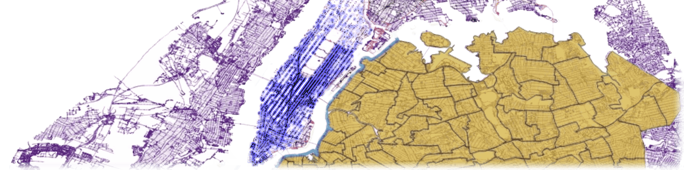

<picture>
  <source media="(prefers-color-scheme: dark)" srcset="figures/banner_dark.png">
  <source media="(prefers-color-scheme: light)" srcset="figures/banner_light.png">
  
</picture>


# Large-scale Ridesharing DARP Instances Based on Real Travel Demand

[](https://arxiv.org/abs/2305.18859)
[](https://doi.org/10.5281/zenodo.7986103)


This repository presents a set of large-scale ridesharing Dial-a-Ride Problem (DARP) instances. The instances were created as a standardized set of ridesharing DARP problems for the purpose of benchmarking and comparing different solution methods.  

The instances are based on real demand and realistic travel time data from 3 different US cities, Chicago, New York City and Washington, DC. The instances consist of real travel requests from the selected period, positions of vehicles with their capacities and realistic shortest travel times between all pairs of locations in each city.

The instances and results of two solution methods, the Insertion Heuristic and the optimal Vehicle-group Assignment method, can be found in the linked dataset. The dataset and methodology used to create it are described in the paper [Large-scale Ridesharing DARP Instances Based on Real Travel Demand](https://arxiv.org/abs/2305.18859).

## Table of contents
- [Instances and Results download](#Instances-and-Results-download)
- [Instances structure](#Instances-structure)
- [Results structure](#Results-structure)
- [Instance creation](#Instance-creation)
- [Citation](#Citation)
- [License](#License)

## Instances and Results download

[](https://doi.org/10.5281/zenodo.7986103)

The dataset of instances and associated results are available through the dataset repository Zenodo. The dataset is compressed by [7zip](https://7-zip.org/) to adhere to the Zenodo dataset size limits, with some of the archives split into multiple parts. The distance matrices, instances, and results are in separate archives. However, the folder structure inside the archives follows the schema described below. Thus, unpacking the distance matrix archives places them in an appropriate directory in the `Instances` folder.  The dataset is licensed under the [Creative Commons Attribution 4.0 International](https://creativecommons.org/licenses/by/4.0/) license.


[](https://drive.google.com/drive/folders/1iTwpQUZdbSC_5kdEb5-eFw2tLPBNnTxh?usp=sharing)

The latest, unversioned variant of the dataset can be downloaded from Google Drive. Note that the full distance matrix files that represent the travel time model are up to 45 GB in size. This latest version of the dataset contains additional undocumented meta-data and may contain results of additional solution methods not described in the paper.

## Instances structure

The instances are organized into directories based on their parameters. That is, an instance in an *area*, with a given *_start time_*, *duration* and *max delay* $\Delta$ is in the following directory structure:

[//]: # (The tree structure generated with https://tree.nathanfriend.io/)

```text
📁 Instances/<area>/
├── 🗎 dm.hd5
└── 📁instances/start_<start time>/duration_<duration>/max_delay_<max delay>/
    ├── 🗎 vehicles.csv
    └── 🗎 requests.csv
```
and consists of three files, `vehicles.csv`, `requests.csv` and `dm.h5`. The `vehicles.csv` and `requests.csv` files are the main instance files, while the `dm.h5` file is the distance matrix file that represents the travel time model $f_t(l, l')$ used in the instance. The instance files are described in detail below.

### Instance Requests and Vehicles files

The instance folder contains the two main instance files:

`📁Instances/<area>/instances/start_<start time>/duration_<duration>/max_delay_<max delay>/`

- `🗎 requests.csv` - a 3 (4) column `<tab>` separated file containing the list of requests $R$ with a header defining the following columns:
  - `time_ms` - a request time in milliseconds from the start of the day $t$
  - `origin` - index of the origin node $o$. Used for indexing into the distance matrix 
  - `dest` - index of the destination node $d$
  - `min_travel_time` (optional) - direct, minimal travel time in seconds between origin and destination nodes
- `🗎 vehicles.csv` - a 2-column `<tab>` separated file containing the set of vehicles $V$ with no header row and the following column meaning:
  - vehicle starting node $s$ 
  - vehicle capacity $c$

A concrete example of an instance path is `Instances/NYC/instances/start_18-00/duration_05_min/max_delay_03_min/`.

### Distance Matrix - the travel time model

`🗎 Instances/<area>/dm.hd5`
  
The travel time model $f_t(l, l')$ that determines the shortest travel time between any two nodes $l$ and $l'$ has a form of distance matrix and is shared by all instances in the same area. 
Since, for some areas, the matrix is quite large, it is saved using the [`hdf5`](https://www.hdfgroup.org/solutions/hdf5/) format. To load the distance matrix into Python, use [`h5py` python package](https://www.h5py.org/). The loading of the distance matrix is implemented in the [`MatrixTravelTimeProvider.from_hdf`](https://github.com/aicenter/Ridesharing_DARP_instances/blob/main/python/darpinstances/instance.py#L62). Method [`get_travel_time(from_index, to_index)`](https://github.com/aicenter/Ridesharing_DARP_instances/blob/main/python/darpinstances/instance.py#L73) implements the access to the distance matrix and is equivalent to $f_t(l, l')$

### Instance metadata and supporting files
  
In addition to the main instance files, the instance and area folders contain several additional files holding metadata about the instance used for instance generation, visualization, or analysis. The list of the files with their location in the directory tree is below. 
  
```text
📁Instances/
├── 📁NYC/
│   └── ...
├── 📁Manhattan/
│   └── ...
├── 📁DC/
│   └── ...
└── 📁Chicago/
    ├── 🗎 dm.h5                              # Area-specific distance matrix                 
    ├── 📁map/
    │   ├── 🖺 nodes.csv                      # List of nodes present in the area          
    │   ├── 🖺 edges.csv                      # List of edges present in the area       
    │   └── 📁shapefiles/                    # Area shapefiles for visualization
    │       ├── 🗺 nodes.[shx, shp, prh, dbf, cpg]
    │       └── 🗺 edges.[shx, shp, prh, dbf, cpg]
    └── 📁instances/
        ├── 📁start_<time>/
        │   ├── 📁duration_<duration>/
        │   │   ├── 📁max_delay_<delay>/
        │   │   │   ├── 🖺 config.yaml        # Instance generation config file
        │   │   │   ├── 🗎 requests.csv       # Requests file
        │   │   │   ├── 🗎 vehicles.csv       # Vehicles file
        │   │   │   ├── 🖺 sizing.csv         # (optional) - file holding data on the instance sizing process
        │   │   │   ├── 🖺 vehicles_pre_sizing.csv    # (optional) - file holding data on the vehicles before the sizing process
        │   │   │   └── 📁shapefiles/        # Instance shapefiles for visualization
        │   │   │       ├── 🗺 vehicles.[shx, shp, prh, dbf, cpg] 
        │   │   │       ├── 🗺 pickup.[shx, shp, prh, dbf, cpg]
        │   │   │       └── 🗺 dropoff.[shx, shp, prh, dbf, cpg]
        │   │   └── ...
        │   └── ...
        └── ...
```

#### Instance generation config files

`📁 Instances/<area>/instances/start_<start time>/duration_<duration>/max_delay_<max delay>/`

- `🖺 config.yaml` contains metadata used in the instance generation. Notable fields are 
  - `demand:`
    - `min_time` and `demand: max_time` give the interval for the demand used in the instance. The format is `yy-mm-dd HH:MM:SS` in the local timezone.
  - `max_prolongation`: the maximum delay $\Delta$ (in seconds) 
  - `vehicles:`
    - `start_time`: The datetime of the start of the vehicle operation. The format is the same as for the demand interval.
    - `vehicle_capacity` - sets the capacity parameter $c$ for the instance generation
    - `vehicle_count` - sets the number of vehicles for the instance generation
  - `map`: the object for the map configuration
    - `SRID`: The SRID of the map projection. Example: `4326` (GPS)
    - `SRID_plane`: The SRID of the map planar projection. Example: `32618` (UTM zone 18N)
- `🖺 sizing.csv` contains the results of the instance sizing, which is the step in the instance generation process that selects the number of vehicles for the instance so that the solution found by the insertion heuristic can service all requests in the instance. See the article for details. The file uses a comma as a separator and contains three columns with a header:
  - `vehicle_count` - the number of vehicles used at a given step of the sizing process
  - `dropped_requests` - the number of requests that cannot be serviced by the given number of vehicles when solved by the insertion heuristic
  - `interval_size` - the size of the interval-halving step used in the sizing process

`📁 Instances/<area>/map/`
- `🖺 nodes.csv` contains information about processed road network nodes in the area. The file uses `<tab>` as a separator and contains four columns with a header:
  - `id` - node index in the distance matrix
  - `db_id` - node id in the database that was used for the  instance generation
  - `x` - node x coordinate in the map plannar projection 
  - `y` - node y coordinate in the map plannar projection
- `🖺 edges.csv` contains information about processed road network edges in the area, including the speed. The file uses `<tab>` as a separator and contains six columns with a header:
  - `u` - from node `id`
  - `v` - to node `id`
  - `db_id_from` - from node `db_id`
  - `db_id_to` - to node `db_id` 
  - `length` - length of the edge in meters
  - `speed` - speed of the edge used in travel time calculations, in km/h.

#### Visualization files

Contains area and instance files for visualization in e.g. [Q-GIS](https://www.qgis.org)

`📁 Instances/<area>/map/shapefiles/`
  - `🗺 nodes.[shx, shp, prh, dbf, cpg]`
  - `🗺 edges.[shx, shp, prh, dbf, cpg]`

`📁 Instances/<area>/instances/start_<start time>/duration_<duration>/max_delay_<max delay>/shapefiles/` 
- `🗺 vehicles.[shx, shp, prh, dbf, cpg]` - starting vehicle locations
- `🗺 pickup.[shx, shp, prh, dbf, cpg]` - request pickup points
- `🗺 dropoff.[shx, shp, prh, dbf, cpg]` - request dropoff points

## Results structure
The results are stored in the `📁 Results/` folder. The folder structure follows a similar pattern as the `📁 Instance/` folder:

```text
📁 Results/<area>/start_<start time>/duration_<duration>/max_delay_<max delay>/<method>/
├── 🖺 config.yaml                   # experiment config file
├── 🗎 config.yaml-solution.json      # results from experiment defined by `config.yaml`
└── 🖺 config.yaml-performance.json  # performance metrics from experiment defined by `config.yaml`
```

The `<method>` folders are `ih` for [Insertion Heuristic]() and `vga` for [Vehicle Group Assignment method](https://www.pnas.org/doi/10.1073/pnas.1611675114). 


### Solution file 
The solution is stored in `🗎 config.yaml-solution.json` and contains the following fields:

`🗎 config.yaml-solution.json`
- `cost` - total cost (total travel time of all vehicles) of the solution in seconds.
- `cost_minutes` - total cost of the solution in minutes, rounded.
- `dropped_requests` - list of requests that were dropped in this solution.
- `plans` - list of vehicle plans; each plan contains a list of actions determining which requests are served by the given vehicle and in which order. The actions are "pickup" and "drop_off".

All locations in the solution file are node ids from the road network. The node ids are the same as in the `🖺 nodes.csv` file in the instance folder. All times are in seconds from the start of the day.

A complete description of the solution format is given by the [json schema](solution_schema.json) in this repository.

### Solution meta-data
There are two files with meta-data for the solution, `🖺 config.yaml` and `🖺 config.yaml-performance.json`

`🖺 config.yaml` file contains the experiment configuration, such as the relative path to the instance, method specific configuration and so on. 

`🖺 config.yaml-performance.json` file contains logged information on the run of the solver. The json has the following fields
- `total_time` - total time of the solver run in seconds
- `peak_memory_KiB` - peak memory usage of the solver in KiB
- `solver_stats`- solver-specific statistics, if available. For example, for the VGA method, `group_generation_time` and `vehicle_assignment_time` are logged separately.

## Instance Creation
The methodology for the instance creation is described in the article. The process is divided into the following steps:


Many of the steps are implemented in the associated repository, but some of them rely on external binaries. That is why the published dataset contains full distance matrices for every area instead of the instance-specific, smaller distance matrices.

[//]: # (## Road Network Processing)

[//]: # (## Demand and Vehicle Processing)

### Public Datasets used in the creation of the instances
The following data sources were used to generate demand and travel time data:

| Area                        | Demand Dataset                                                                                     | Zone Dataset                          | Request times |
|-----------------------------|----------------------------------------------------------------------------------------------------|---------------------------------------|---------------|
| New York City and Manhattan | [NYC Taxi and Limousine Commission](https://www1.nyc.gov/site/tlc/about/tlc-trip-record-data.page) | [NYC taxi zones]()                    | exact         |
| Chicago                     | [City of Chicago](https://data.cityofchicago.org/Transportation/Taxi-Trips/wrvz-psew)              | [Census tracts and community areas]() | generated     |
| Washington, DC              | [City of Washington, DC](https://opendata.dc.gov/search?q=taxi%20trips)                            | [Master Address Repository]()         | generated     |

## Citation
When using the instances or the code, please cite the following [paper](https://arxiv.org/abs/2305.18859): 

[1] D. Fiedler and J. Mrkos, “Large-scale Ridesharing DARP Instances Based on Real Travel Demand.” arXiv, May 30, 2023. doi: 10.48550/arXiv.2305.18859.

Bibtext entry:
```bibtex
@misc{fiedler2023largescale,
      title={Large-scale Ridesharing DARP Instances Based on Real Travel Demand}, 
      author={David Fiedler and Jan Mrkos},
      year={2023},
      eprint={2305.18859},
      archivePrefix={arXiv},
      primaryClass={cs.AI}
}
```

## License
The code in the repository used to generate the instances is licensed using the [GNU GENERAL PUBLIC LICENSE v3](https://www.gnu.org/licenses/gpl-3.0.en.html).

The dataset is licensed using the [Creative Commons Attribution 4.0 International (CC BY 4.0)](https://creativecommons.org/licenses/by/4.0/) license.
